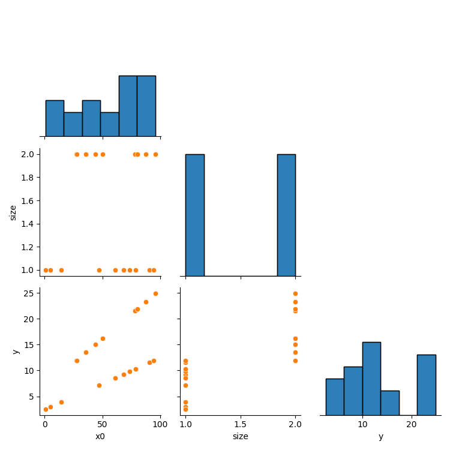
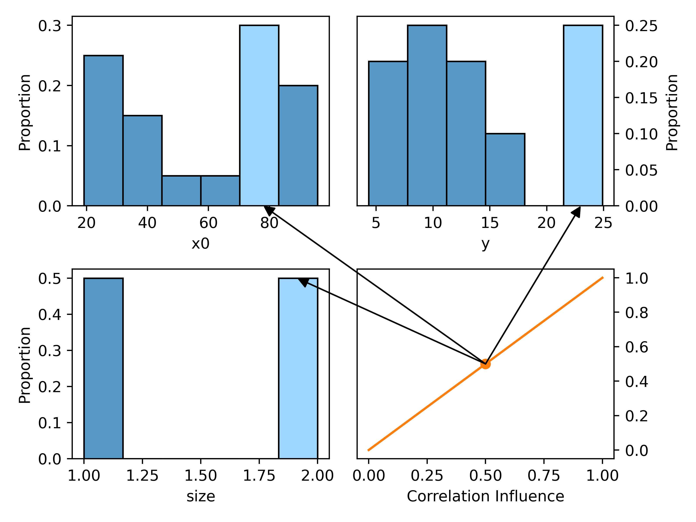
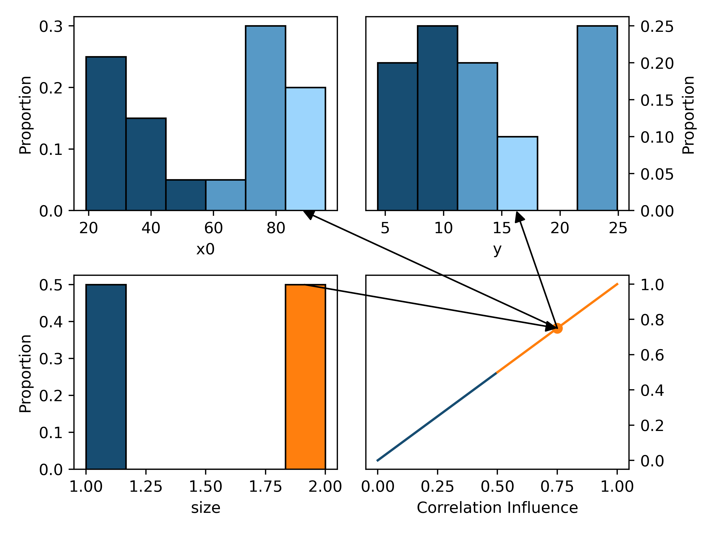
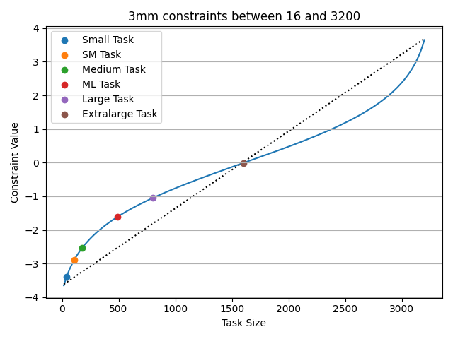

# Conditional Sampling for Gaussian Copulas

# High-Level Explanation

When the Gaussian Copula samples, it forms a multivariate normal distribution based on its covariance matrix and then uses marginal distributions to select individual variable values.
While actual models are more complex, consider a one-dimensional case with two marginal variables and a joint representation:



## Unconditional Sampling with Gaussian Copula

We visually represent the highest-level concepts of sampling using the assortment of plots below.
Each variable's plot represents a histogram of sample-able values, while the covariance plot in the bottom right is an arbitrary 2D representation of their positive correlation.
While the _real_ correlation for this relationship is three-dimensional, we simplify to two dimensions for demonstration purposes.



Without conditional sampling, the model's identified covariance (orange region of the covariance plot) is used with zero-means (no marginal biases; represented by the central dot) to randomly sample from the multivariate normal distribution.

The outgoing arrows are marginally sampled from this mean and covariance operating as descriptors of a multivariate distribution, with the actual sampled values for a single sample highlighted in a lighter shade of blue.
We provide greater detail of sampling mathematics in the lower-level explanation that follows this section.

## Conditional Sampling with Gaussian Copula

When conditional sampling is utilized, one or more particular _marginal values_ are specified as a set of conditions that modify the covariance and means for the multivariate sampling distribution.
This is similar to picking a value for a marginal variable, tracing it back and constraining covariance and means to the range that could produce it, then sampling other values based on that information:



In this example, we condition the size (the orange bar) to be exactly 2.0 -- the 1.0 size is darkened as it cannot be sampled when this condition is applied.
The arrow from the size to covariance represents the condition applied by this assumption.
The mean and sample-able covariance shift due to the selection, with unsample-able correlations in dark blue on this plot.
The altered mean and covariance are then used to sample as before, with light blue highlighting a single sample's values.
However, due to the changes, some values in the remaining marginal variables X0 and Y are _very unlikely_ to be sampled (shown in darker blue).

Conditional sampling uses correlation and means to ensure that even if some marginal values are manually specified, the remaining values are generated in a manner that conforms to the subset of statistical relationships that can satisfy the condition.

# Low-Level: How does Conditional Sampling Actually Work for Gaussian Copulas?

_NOTE:_ This guide is provided for greater discussion of conditional sampling and to ease reproducibility of our work.
We frequently refer to [SDV](https://github.com/sdv-dev/SDV) as our implementation for various mechanics and components in this discussion.
Please be aware that SDV is a _rapidly_ evolving library, and many references have already been deprecated between the time of research and publication.
This guide _will not_ endeavor to maintain consistency with modern SDV, so note that all notation, references, and names are based on the library as of release version `0.14.1`, the same version used in our reported results.
Links to SDV's documentation may become broken or have their content updated over time, so they are used minimally and only provided as a convenience.

Conditional sampling is a means of sampling from a distribution that _guarantees_ specified conditions will be simultaneously held for all generated data, if possible.
This is defined and enforced through two mechanisms: _constraints_ and _conditions_.

_Constraints_ are limitations that all data must adhere to at all times.
Constraints ensure that proper bounds are known for model fitting so that training data does not over-specify model behavior -- especially when transferring to out-of-distribution (extrapolated) trends.

> In theory, any constraint relevant to the sampled distribution can be specified, but we refer to the [Synthetic Data Vault's constraints](https://docs.sdv.dev/sdv/reference/constraint-logic/predefined-constraint-classes) as concrete implementations of a broad variety of useful constraints.
These constraints include requiring values to be either positive or negative, fixing upper and/or lower bounds to value ranges, one-hot encoding over multiple columns, etc.

> For our work, we focus on constraining a range of values, such as the range of task sizes, _t_, that can be generated.

_Conditions_ are more specific constrained requirements imposed during sampling; they only apply to a particular instance of synthetic data generation.
In our work, conditions are used to specify an _exact_ task to be sampled during model inference.

>SDV permits condition implementation by [defining a Condition object and a number of samples to represent the specified condition](https://docs.sdv.dev/sdv/single-table-data/sampling#simulate-scenarios).
We will detail how to utilize these conditions later.

## Implementation Specifics: Constraints

The mathematical and mechanical details of constraint specification are provided here, separate from SDV to ensure their persistence.

### Defining Constraints for a Benchmark

Using SDV, we can specify a constraint on the task column that limits the range of generated data between an upper and lower bound.
This requires us to have some notion of a "greatest" and "least" task, which corresponds to the scale of the input provided during autotuning.
The specific values of this range are manually defined to encapsulate all tasks we intend to use as either transfer-learning sources or transfer-learning targets.

> As a concrete example, refer to [the 3mm benchmark's .h file](benchmark/_3mm_exp/3mm.h).
Each "dataset" defines the _NI,NJ,NK,NL,_ and _NM_ sizes for array dimensions in this kernel, ranging from "Mini" (16,18,20,22,24) to "Huge" (3200,3600,4000,4400,4800).
The input sizes do not have linear scaling and the work done by the kernel has cubic scaling with input size, so we do not use categorical encoding for the task sizes.
We arbitrarily utilize the _NI_ size as an integer indication of the work to be done, such that our constraint specifies that tasks have values inclusively between 16 and 3200.
The sizes for each dataset are represented in [the problem specification for each benchmark](https://github.com/tlranda/ytopt/blob/08c81ba62b5c2209ef6f30b6a772d1053f234463/ytopt/benchmark/_3mm_exp/problem.py#L59).
In our code, this dictionary maps the integer size to a tuple of string names that can be used to identify the size.
Therefore the SDV constraints for a problem are defined by the minimum and maximum for task sizes, as we've done for our [Polybench problem factory](https://github.com/tlranda/ytopt/blob/08c81ba62b5c2209ef6f30b6a772d1053f234463/ytopt/benchmark/base_problem.py#L315).

### Satisfying Constraints During Model Training

Constraints have to satisfied at all times, including model training, so we gather constraints before fitting to data and [use them in the SDV object constructor](https://github.com/tlranda/ytopt/blob/08c81ba62b5c2209ef6f30b6a772d1053f234463/ytopt/benchmark/base_online_tl.py#L304).
As such, when we represent data to the Gaussian Copula model, every record _must_ satisfy all constraints.

> We add the integer size for _t_ to each collected sample indicating the source task scale.
Since our factories are capable of representing the task size in their assembled objects, we load an appropriate object and [reference its data to locate previous autotuning records from disk](https://github.com/tlranda/ytopt/blob/08c81ba62b5c2209ef6f30b6a772d1053f234463/ytopt/benchmark/base_online_tl.py#L538).
After acquiring the source tuning data, we add the `problem_class` attribute [to each loaded record](https://github.com/tlranda/ytopt/blob/08c81ba62b5c2209ef6f30b6a772d1053f234463/ytopt/benchmark/base_online_tl.py#L574), so each source task is properly annotated based on the same definitions used to collect the data.

In SDV, constraints are not limited to data validation and typically specify data transformations using Reversible Data Transformers (RDT).
As such, data is altered by constraints prior to being presented to the model, and any data generated by the model uses the inverse transformation to reverse these changes.
Transforming data with RDT's can transparently improve the learning representation for models.
We specify upper- and lower-bounded ranges for task sizes, which means the constraint's RDT scales incoming task size features and applies a logit:

$t = 0.95 \times \frac{t-low}{high-low} + 0.025$

$t = ln \lparen\frac{t}{1 - t}\rparen$

The inverse operation is applied to model outputs so that this transformation does not alter the domain expressed by the model.
The nonlinear transformation applied on 3mm tasks is pictured below, with actual tasks represented on the function line and a dotted linear trend for comparison:



## Mathematics Behind Gaussian Copula Sampling

The Gaussian Copula fits marginal distributions to each input variable, then forms a covariance matrix to express variable codependencies.

_Without conditions_, sampling assumes a multivariate normal distribution with zero-means and the same covariance that was learned during model training.
Each variable is then assigned an output value based on the Gaussian Copula's marginal distribution by identifying the CDF of the sample and percentage point from the marginal distribution:

```python3
one_sample = np.random.multivariate_normal(np.zeros(len(marginals)), COVARIANCE_MATRIX, size=1)[0]
# Transform sampled values into marginal domains based on the source data
outputs = np.empty(len(marginals), dtype=object)
for sample_value, marginal, idx in zip(one_sample, marginals, itertools.count()):
  cdf = scipy.stats.norm.cdf(sample_value)
  outputs[idx] = marginal.percent_point(cdf)
```

One or more conditions can be specified, however.
A condition is _inflexible_: each condition specifies one or more column values and the _exact_ value that column will have, as well as how many samples must adhere to the condition.
To simulate a variety of conditions, SDV requires a unique condition must be generated for each _unique combination_ of constrained values.
Fortunately, a single condition sufficies for our purposes: `Condition(num_rows=X, column_values={'input': SIZE})`.
We [define a single condition for each task size to generate simultaneously](https://github.com/tlranda/ytopt/blob/08c81ba62b5c2209ef6f30b6a772d1053f234463/ytopt/benchmark/base_online_tl.py#L366), though in practice we only tune one size at a time.

The Gaussian Copula will apply the constraint RDT to ensure the task size is properly represented, then [compute the components of the corresponding conditional distribution](https://en.wikipedia.org/wiki/Multivariate_normal_distribution#Conditional_distributions).
This alters the means and covariance of the multivariate distribution based on the provided conditions and original covariance.
The new multivariate distribution describes remaining variance after ensuring a particular outcome from the conditioned variable responses.
SDV finalizes the construction of the output the same as before, but conditioned variables _explicitly_ take on the condition value.

```python3
def get_conditional_distribution(normal_conditions, covariance):
    cond_cols = normal_conditions.index
    unconditioned_cols = covariance.columns.difference(cond_cols)
    # Form the vectors and arrays for conditional sampling
    sigma11 = covariance.loc[unconditioned_cols, unconditioned_cols].to_numpy()
    sigma12 = covariance.loc[unconditioned_cols, cond_cols].to_numpy()
    sigma21 = covariance.loc[cond_cols, unconditioned_cols].to_numpy()
    sigma22 = covariance.loc[cond_cols, cond_cols].to_numpy()
    mu1 = np.zeros(len(unconditioned_cols))
    mu2 = np.zeros(len(cond_cols))
    # Form the conditional distribution
    sigma12sigma22inv = sigma12 @ np.linalg.inv(sigma22)
    cond_means = mu1 + sigma12sigma22inv @ (normal_conditions - mu2)
    cond_covariance = sigma11 - sigma12sigma22inv @ sigma21
    return cond_means, cond_covariance, cond_cols

CONDITIONED_MEANS, CONDITIONED_COVARIANCE_MATRIX, conditioned_cols = get_conditional_distribution(pd.Series([condition_value], index=[condition_col]), model_covariance)
one_sample = np.random.multivariate_normal(CONDITIONED_MEANS, CONDITIONED_COVARIANCE_MATRIX, size=1)[0]
# Reconstruct from marginals as in unconditional sampling...
```

A complete walkthrough of the mathematics for both conditional and unconditional sampling with the Gaussian Copula is provided in [gc_vis.py](gc_vis.py)
